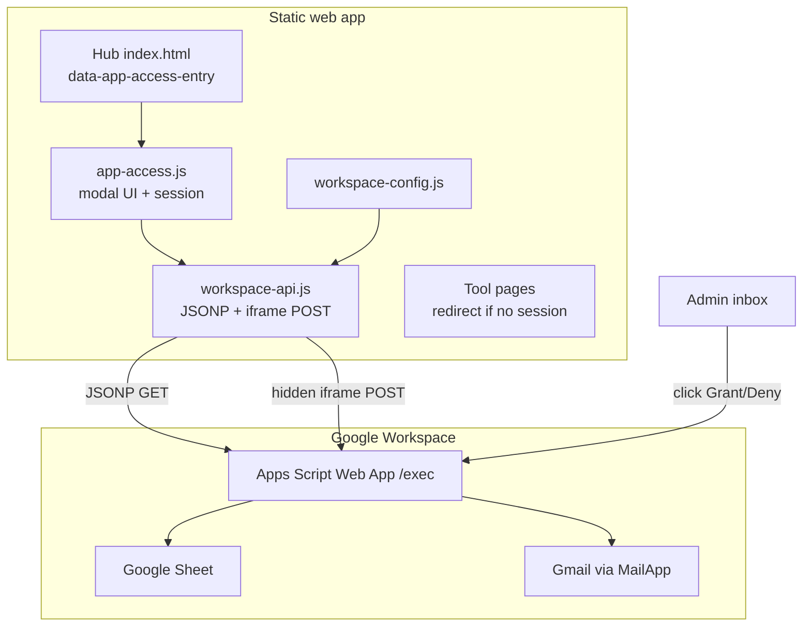

# Access Control Blueprint — Static App + Google Apps Script

This document describes how **Trimble Technician Assistant** gates access with work-email verification, admin approval, and 6-digit sign-in codes. Use it to replicate the same system in another static web app.

**This is not AppSheet.** The backend is **Google Sheets + Google Apps Script + Gmail** (`MailApp.sendEmail`).

**Reference files in this repo:**

| File | Role |
|------|------|
| `google-workspace/Code.gs` | Server logic |
| `google-workspace/DEPLOY.md` | Deploy checklist |
| `assets/workspace-config.js` | Client config |
| `assets/workspace-api.js` | Apps Script HTTP client |
| `assets/app-access.js` | Gate UI + browser session |
| `assets/app-access.css` | Gate modal styles |
| `docs/DEALER-APP.md` | Broader app architecture |

---

## What you are building

A **gate in front of a static web app** where:

1. User enters work email on the hub.
2. **Trusted domains** (e.g. `@trimble.com`) are auto-approved and receive a **6-digit email code**.
3. **Everyone else** triggers an **admin email** with **Grant / Deny** links.
4. On grant, the user receives an email with the **6-digit code** and an app link.
5. User re-enters email in the app, enters the code, and gets a **28-day session** stored in the browser.
6. Tool pages trust the session; expired or revoked users are redirected to the hub.

**Hosting:** GitHub Pages (or any static host).  
**Backend:** One Google Apps Script web app bound to a Google Sheet.  
**Email:** `MailApp.sendEmail()` from Apps Script.

---

## Architecture



---

## File map (recommended structure)

| File | Role |
|------|------|
| `google-workspace/Code.gs` | All server logic: access, codes, emails, sheets |
| `google-workspace/DEPLOY.md` | Setup checklist |
| `assets/workspace-config.js` | Client config (endpoint URL, timers, auto-approve domains) |
| `assets/workspace-api.js` | HTTP client to Apps Script |
| `assets/app-access.js` | Gate UI + localStorage session |
| `assets/app-access.css` | Gate modal styles |
| `index.html` | Hub only — `<body data-app-access-entry>` |
| Every tool `index.html` | Loads `app-access.js` but **not** `data-app-access-entry` |

**Optional second layer (BETA tools):**

- `assets/beta-access.js` / `assets/beta-access.css`
- `data-beta-tool="<id>"` on tool `<body>`

---

## Variables — must stay in sync

### Apps Script `CONFIG` (top of `Code.gs`)

```javascript
var CONFIG = {
  SPREADSHEET_ID: 'YOUR_SHEET_ID',
  DRIVE_FOLDER_ID: 'OPTIONAL_FOR_REPORT_UPLOADS',
  RECIPIENT_EMAIL: 'admin@yourcompany.com',      // Gets access-request emails
  APP_URL: 'https://youruser.github.io/your-app/', // Link in approval emails
  ACCESS_GRANT_DAYS: 28,                          // Session length after code verify
  AUTO_APPROVE_DOMAINS: 'trimble.com,trimblecorp.net', // Comma-separated; subdomains match
  ACCESS_CODE_MINUTES: 15,                        // 6-digit code TTL
};
```

### Client `WORKSPACE_CONFIG` (`workspace-config.js`)

```javascript
window.WORKSPACE_CONFIG = {
  endpoint: 'https://script.google.com/macros/s/YOUR_DEPLOYMENT_ID/exec',
  appVersion: '2026.01.01',
  appName: 'Your App Name',
  recipientEmail: 'admin@yourcompany.com',
  appUrl: 'https://youruser.github.io/your-app/',
  accessGrantDays: 28,        // Must match CONFIG.ACCESS_GRANT_DAYS
  accessCodeMinutes: 15,      // Must match CONFIG.ACCESS_CODE_MINUTES
  telemetryEnabled: true,
  autoApproveDomains: ['trimble.com', 'trimblecorp.net'], // Must match CONFIG
};
```

**Rule:** If you change grant days, code minutes, or auto-approve domains on the server, update the client config too.

---

## Google Sheet tabs

Run **`setupSheets`** once from the Apps Script editor (see `google-workspace/DEPLOY.md`).

### `AccessRequests`

| Column | Purpose |
|--------|---------|
| timestamp | When requested |
| email | User email |
| status | `pending` / `approved` / `denied` |
| token | UUID for one-click Grant/Deny links |
| requestedAt | ISO date |
| resolvedAt | When admin acted |
| resolvedBy | Admin email |
| userAgent, deviceType, page | Telemetry context |

### `ApprovedUsers`

| Column | Purpose |
|--------|---------|
| email | Normalized lowercase |
| grantedAt | ISO |
| expiresAt | ISO — `now + ACCESS_GRANT_DAYS` |
| grantType | `trimble_auto` or `manual` |
| approvedBy | Admin or `auto` |
| lastCheckAt | Updated on each `access_check` |
| revokeToken | UUID for revoke link |
| Revoke | HYPERLINK formula → `?action=access_revoke` |

### `AccessCodes`

| Column | Purpose |
|--------|---------|
| email | User |
| code | 6-digit string |
| expiresAt | ISO — `now + ACCESS_CODE_MINUTES` |
| createdAt | ISO |

### `Events` (optional but recommended)

Telemetry: `access_requested`, `access_granted`, `access_denied`, `access_verified`, `access_revoked`.

---

## API contract (Apps Script web app)

Deploy as **Web app → Execute as: Me → Who has access: Anyone**.

### GET handlers (JSONP — client adds `&callback=ttaJsonp_...`)

| `action` | Params | Returns |
|----------|--------|---------|
| `access_start` | `email`, `tool`, `page`, `userAgent`, `deviceType` | See flows below |
| `access_check` | `email`, optional `revalidate=1` | Current status |
| `access_verify` | `email`, `code` (6 digits) | `{ ok, status:'approved', expiresAt, grantType }` |
| `access_resend_code` | `email` | New code if approved |
| `access_approve` | `email`, `token` | **HTML page** (admin clicked email link) |
| `access_deny` | `email`, `token` | **HTML page** |
| `access_revoke` | `email`, `token` | **HTML page** |

### POST handlers (hidden iframe — `payload` JSON field)

| `action` | Purpose |
|----------|---------|
| `event` | Telemetry |
| `feedback` | User feedback |
| `upload` | Optional Drive report archive |
| `access_request` | Legacy alias of `access_start` |

### `access_start` response statuses

| `status` | Meaning | Client behavior |
|----------|---------|-----------------|
| `pending` | Waiting for admin | Show “Waiting for approval” |
| `verify_code` | Approved; code sent (or reuse) | Show 6-digit input |
| `approved` | Already valid grant (rare on start) | Unlock immediately |
| `denied` | Last request denied | Show denied message |

### `access_check` with `revalidate=1`

Used on hub load and periodically to confirm the grant still exists in `ApprovedUsers`. Returns `approved` + `expiresAt`, or `expired` / `denied` / `none`.

---

## User flows

### Flow A — Auto-approve domain (e.g. `@trimble.com`)

```
User submits email
  → handleAccessRequest()
  → isAutoApproveEmail() === true
  → upsertApprovedUser(email, 'trimble_auto', 'auto')
  → ensureAccessCode(email, forceNew: true)
  → sendAccessCodeEmail() — 6-digit code only
  → return { status: 'verify_code', codeSent: true }

User enters code
  → access_verify
  → verifyAccessCode() — match + not expired, then delete code row
  → return { status: 'approved', expiresAt, grantType }
  → client saves to localStorage (28 days)
```

**No admin email** for auto-approve domains.

### Flow B — External user (manual approval)

```
User submits email
  → createPendingAccessRequest() — row in AccessRequests, UUID token
  → sendAccessAdminEmail() to RECIPIENT_EMAIL
     - Grant: ?action=access_approve&email=...&token=...
     - Deny:  ?action=access_deny&email=...&token=...
  → return { status: 'pending' }

Admin clicks Grant
  → handleAccessApprove()
  → resolveAccessRequest('approved')
  → upsertApprovedUser(email, 'manual', admin)
  → issueAccessCode()
  → sendAccessApprovedUserEmail(email, expiresAt, signInCode)
     - App link + 6-digit code in one email
  → HTML confirmation page

User opens app, submits same email
  → access_start → already approved → verify_code (may resend code)
User enters code → access_verify → session saved
```

### Flow C — Returning approved user (within grant period)

```
Hub/tool loads
  → read localStorage tta-app-access-v1
  → if expiresAt > now → unlock
  → background access_check?revalidate=1
  → if revoked/expired → lock + redirect to hub
```

### Flow D — Revoke

- Admin clicks **Revoke access** in `ApprovedUsers` sheet, or
- Opens `?action=access_revoke&email=...&token=...`
- Deletes row from `ApprovedUsers`, clears `AccessCodes`
- User locked out on next `access_check`

---

## Client implementation

### Why JSONP + iframe (not `fetch`)

Apps Script does not expose CORS for arbitrary origins. This app uses:

- **JSONP** (`<script src="endpoint?action=...&callback=...">`) for read/access actions
- **Hidden iframe form POST** for telemetry/feedback

Do not switch to `fetch()` unless you add CORS handling or a different backend.

### `app-access.js` — key behaviors

| Concept | Implementation |
|---------|----------------|
| Hub gate | `document.body.hasAttribute('data-app-access-entry')` |
| Tool pages | `bootstrapVisitor()` — session required or redirect to hub |
| localStorage key | `tta-app-access-v1` → `{ email, expiresAt, grantType, savedAt }` |
| sessionStorage key | `tta-app-access-session-v1` (same shape, tab session) |
| Pending email | `tta-app-access-pending-email-v1` |
| Local dev bypass | `localhost` / `file:` → auto-unlock as `local-preview` |
| Events | `tta:access-ready` dispatched when unlocked |
| Sign out | Clears storage, shows gate on hub |

### Hub HTML

```html
<body data-app-access-entry>
  ...
  <script src="./assets/workspace-config.js"></script>
  <script src="./assets/workspace-api.js"></script>
  <script src="./assets/app-access.js"></script>
</body>
```

### Tool HTML

```html
<body>
  ...
  <script src="../assets/workspace-config.js"></script>
  <script src="../assets/workspace-api.js"></script>
  <script src="../assets/app-access.js"></script>
  <!-- NO data-app-access-entry — redirect-only mode -->
</body>
```

### `workspace-api.js` — methods to implement

```javascript
WorkspaceApi.startAccess(email)               // GET access_start
WorkspaceApi.verifyAccessCode(email, code)  // GET access_verify
WorkspaceApi.resendAccessCode(email)        // GET access_resend_code
WorkspaceApi.checkAccess(email, { revalidate: true }) // GET access_check
```

---

## Email templates

### 1. Admin — access request

- **To:** `CONFIG.RECIPIENT_EMAIL`
- **Subject:** `[Your App] Access request — user@domain.com`
- **Body:** Grant and Deny buttons linking to Apps Script `access_approve` / `access_deny` with `email` + `token`

### 2. User — sign-in code only (auto-approve path)

- **Subject:** `Your App — your sign-in code`
- **Body:** Large 6-digit code, expires in `ACCESS_CODE_MINUTES` minutes

### 3. User — access approved (manual path)

- **Subject:** `Your App — access approved`
- **Body:** “Open app” button (`APP_URL`) + 6-digit code + grant expiry date

### 4. User — denied

Plain text: not approved, contact representative.

**Code generation:** 6 random digits, stored in `AccessCodes`, cleared after successful verify or on expiry.

**Throttle:** Won’t send a new code within 60 seconds of the last one.

---

## Apps Script deploy checklist

1. Create Google Sheet → copy ID into `CONFIG.SPREADSHEET_ID`.
2. Extensions → Apps Script → paste `Code.gs`.
3. Set all `CONFIG` values (`RECIPIENT_EMAIL`, `APP_URL`, domains, timers).
4. Run **`setupSheets`** once (creates tabs + headers).
5. Deploy → New deployment → **Web app** → Execute as **Me** → Access **Anyone**.
6. Copy `/exec` URL into `workspace-config.js` → `endpoint`.
7. Test end-to-end (see test script below).

---

## Optional: BETA tool gate (second layer)

Same pattern with extra sheets `BetaAccessRequests` / `BetaApprovedUsers` and actions `beta_access_start`, `beta_access_check`, `beta_access_approve`, `beta_access_deny`.

- User must already be in `ApprovedUsers`.
- Tool page: `<body data-beta-tool="my-tool-id" class="beta-access-locked">`
- Tool JS waits for `tta:beta-access-ready` before init.

See `google-workspace/DEPLOY.md` → “BETA tool access” and `assets/beta-access.js`.

---

## Cursor prompt (copy for the other team)

```text
Build an email-gated access system for our static web app using the same architecture as Trimble Technician Assistant (see docs/ACCESS-CONTROL-BLUEPRINT.md in the reference repo).

STACK
- Static HTML/JS hosted on GitHub Pages
- Google Apps Script web app (deployed "Execute as me", "Anyone" access)
- Google Sheet as database (AccessRequests, ApprovedUsers, AccessCodes, Events)
- Gmail via MailApp.sendEmail

ACCESS FLOW
1. Hub page has data-app-access-entry and shows a modal: work email → request access
2. AUTO_APPROVE_DOMAINS (comma-separated, subdomains included): skip admin approval, upsert ApprovedUsers, email 6-digit code immediately, return status verify_code
3. Other domains: create pending AccessRequests row with UUID token, email admin Grant/Deny links (?action=access_approve|access_deny&email&token)
4. On approve: upsert ApprovedUsers (28-day expiresAt), email user app link + 6-digit code
5. User re-enters email, enters code, client calls access_verify; on success save {email, expiresAt, grantType} to localStorage key tta-app-access-v1
6. Tool pages load app-access.js without data-app-access-entry: if no valid session, redirect to hub with ?return= path
7. Background revalidate via access_check?revalidate=1; revoke deletes ApprovedUsers row and clears AccessCodes

CONFIG (keep server + client in sync)
- ACCESS_GRANT_DAYS / accessGrantDays: 28
- ACCESS_CODE_MINUTES / accessCodeMinutes: 15
- AUTO_APPROVE_DOMAINS / autoApproveDomains: trimble.com,trimblecorp.net
- RECIPIENT_EMAIL: admin inbox
- APP_URL / appUrl: public GitHub Pages URL
- endpoint: Apps Script /exec URL

API (JSONP GET with callback param for access actions; hidden iframe POST for telemetry)
- access_start, access_check, access_verify, access_resend_code
- access_approve, access_deny, access_revoke (HTML responses for admin links)

CLIENT MODULES
- workspace-config.js — all config vars
- workspace-api.js — jsonpGet + postPayload via hidden iframe (no fetch/CORS)
- app-access.js — gate UI, session storage, hub vs visitor bootstrap
- app-access.css — modal styles

Do NOT use AppSheet. Do NOT use fetch() against Apps Script without CORS handling.

Reference implementation:
- google-workspace/Code.gs
- assets/workspace-config.js, workspace-api.js, app-access.js
- google-workspace/DEPLOY.md
```

---

## Security notes

| Topic | Reality |
|-------|---------|
| Strength | Good for **field tool gating** and **admin-controlled allowlist** |
| Not | Enterprise SSO, OAuth, or tamper-proof DRM |
| Session | Stored in **browser localStorage** — device-specific |
| Endpoint | Apps Script URL is public; security is server-side sheet checks + tokens |
| Codes | Single-use, 15-minute TTL (configurable) |
| Grants | 28-day expiry (configurable); revocable from sheet |

---

## End-to-end test script

After deploy, verify in order:

1. Open hub → gate appears.
2. Submit `@your-auto-domain.com` email → receive 6-digit code (no admin email).
3. Enter code → hub unlocks.
4. Open a tool page → no redirect.
5. Submit `external@gmail.com` → admin gets Grant/Deny email.
6. Click Grant → user gets approval + code email.
7. External user verifies → access works.
8. Revoke in `ApprovedUsers` → user locked on next page load.

---

## Related docs

- [DEALER-APP.md](./DEALER-APP.md) — Full dealer app architecture and deploy checklist
- [../google-workspace/DEPLOY.md](../google-workspace/DEPLOY.md) — Apps Script setup, sheets, BETA access, troubleshooting
